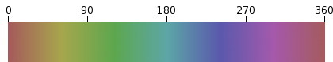
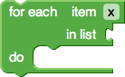
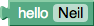
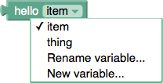
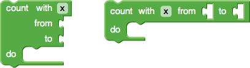
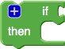

**[Creating Custom Blocks](CustomBlocks): Defining Blocks**

Note that much of block creation can be done through the Blockly GUI using [Block Factory](https://blockly-demo.appspot.com/static/apps/blockfactory/index.html) instead of manually creating the code given below.

# Defining a Block

Go to the ` blocks/ ` directory.  Assuming your block(s) don't fit in the existing categories, create a new JavaScript file.  This new JavaScript file needs to be included in the list of ` <script ...> ` tags in the editor's HTML file.

A typical block definition looks like this:
```
Blockly.Blocks['text_length'] = {
  init: function() {
    this.setHelpUrl('http://www.w3schools.com/jsref/jsref_length_string.asp');
    this.setColour(160);
    this.appendValueInput('VALUE')
        .setCheck('String')
        .appendField('length');
    this.setOutput(true, 'Number');
    this.setTooltip('Returns number of letters in the provided text.');
  }
};
```


  * ` text_length ` is the name of the block.  Since all blocks share the same namespace, it is good to use a name made up of your category (in this case ` text `) followed by your block's function (in this case ` length `).
  * ` init ` is a function which defines the look and feel of the block.

## Init Function

The ` init ` function creates the block's shape.  In the context of this function the keyword ` this ` is the actual block being created.  There are several functions commonly used in an ` init ` function:

  * [setHelpUrl](#setHelpUrl)
  * [setColour](#setColour)
  * [setOutput](#setOutput)
  * [setPreviousStatement](#setPreviousStatement)
  * [setNextStatement](#setNextStatement)
  * [appendDummyInput, appendValueInput, appendStatementInput ](#appendDummyInput,_appendValueInput,_appendStatementInput)
    * [setCheck](#setCheck)
    * [setAlign](#setAlign)
    * [appendField](#appendField)
  * [setInputsInline](#setInputsInline)
  * [setTooltip](#setTooltip)
  * [setMutator](#setMutator)
  * [setDeletable](#setDeletable)
  * [setEditable](#setEditable)
  * [setMovable](#setMovable)

### setHelpUrl

```
    this.setHelpUrl('http://www.w3schools.com/jsref/jsref_length_string.asp');
```

The URL of the page which should open when the user right-clicks on the block and chooses help.  If this value is ` null ` then the menu will be greyed out.  Advanced blocks may specify a function (instead of a static string) which returns a URL string, thus allowing for dynamic help.

### setColour

```
    this.setColour(160);
```
Blockly uses a [Hue-Saturation-Value](https://en.wikipedia.org/wiki/HSL_and_HSV) (HSV) colour model.  Saturation and Value are hard-coded into Blockly, whereas the Hue is defined on each block.  This ensures that developers have the freedom to choose from a wide range of colours, while still guaranteeing that all the blocks will fit together visually.  It also allows the entire Blockly look and feel to be made brighter (for children) or more depressing (for businesses) by simply adjusting the two hard-coded Saturation and Value constants.



To find a good colour, visit this [HSV picker](http://www.rapidtables.com/web/color/color-picker.htm), enter Blockly's Saturation and Value constants (the defaults are 45% and 65% respectively), then slide the Hue as desired.  Use this Hue value as the argument to the ` this.setColour ` function.  Note the British spelling.  Failure to set the colour results in a black block.

### setOutput

```
    this.setOutput(true, 'Number');
```


Value blocks (as opposed to statements) need an output tab.  Blocks with an output tab may not also have a previous statement notch.

This function also defines the expected value type that this block will output.  A block that outputs a number will refuse to connect to a block that inputs a string (e.g. ` length(123) ` does not make sense).  Use a short descriptive string, such as ` "Boolean" `, ` "Number" `, ` "String" `, or ` "Array" `.

In the event that the block could return more than one type of value, use an array of types (e.g. ` ["Number", "Date"] `).  If the block could return any type of value (such as a variable's getter block), use ` null ` as the value.

### setPreviousStatement

```
    this.setPreviousStatement(true);
```


Creates a notch at the top of the block, so that it may be plugged into a stack of statements.  Normally combined with ` setNextStatement ` (see below).  Blocks with a previous statement notch may not also have an output tab.

Optionally (and not typically), this function can take a second argument to limit the types of statements this block may be connected to.

### setNextStatement

```
    this.setNextStatement(true);
```


Creates a notch at the bottom of the block, so that other statements may be stacked below it.  Unless this block terminates flow (e.g. break, return, or end), this is normally combined with ` setPreviousStatement ` (see above).

Optionally (and not typically), this function can take a second argument to limit the types of statements this block may be connected to.

### appendDummyInput, appendValueInput, appendStatementInput

```
    this.appendDummyInput()
        .appendField('for each')
        .appendField('item')
        .appendField(new Blockly.FieldVariable());
    this.appendValueInput('LIST')
        .setCheck('Array')
        .setAlign(Blockly.ALIGN_RIGHT)
        .appendField('in list');
    this.appendStatementInput('DO')
        .appendField('do');
```



Each block has a list of input rows.  There are three types of inputs:

  * ` appendDummyInput ` - Not an connector, just a row for fields.
  * ` appendValueInput ` - A socket in which to plug a value block.
  * ` appendStatementInput ` - A notch for a stack of statement blocks.

All three types are demonstrated in the "for each" block above.

The value and statement functions take a string that specifies the language-neutral name of the input. These names allow inputs to be reordered in different languages; for instance in one language a block might say "get (X) from (Y)" whereas in another language the same block might say "from (Y) get (X)".  The block's code generator can use the names to find input "Y" regardless of where it is located in the block.

Dummy inputs generally do not require names and may be called without argument.

Once an input is created and appended to the block, it may be configured using 'method chaining'[[?](https://en.wikipedia.org/wiki/Method_chaining)].  There are three functions that are used for configuring inputs.

#### setCheck

```
    input.setCheck(Number);
```

This optional function is used for type-checking of connected inputs.  If given an argument of null, then this input may be connected to any block.  See [setOutput](#setOutput) for details on the expected values.

#### setAlign

```
    input.setAlign(Blockly.ALIGN_RIGHT);
```

This optional function is used to align the fields (see below).  There are three self-descriptive values which may be passed as an argument to this function: ` Blockly.ALIGN_LEFT `, ` Blockly.ALIGN_RIGHT `, and ` Blockly.ALIGN_CENTRE `.  Note the British spelling of 'centre'.  Left alignment is the default.

When designing blocks for RTL (Arabic and Hebrew), left and right are reversed.  Thus ` Blockly.ALIGN_RIGHT ` would align fields to the left.

#### appendField

Once an input has been created and appended to a block with ` appendInput `, one may optionally append any number of fields to the input.  These fields are often used as labels to describe what each input is for.  There are many different types of fields.

```
    input.appendField('hello');
```


An input row can contain any number of field elements.  The simplest field element is text.  Blockly's convention is to use all lowercase text, with the exception of proper names (e.g. Google, SQL).

```
    var textInput = new Blockly.FieldTextInput('Neil');
    input.appendField(textInput, 'NAME');
```



Another field element is a text input.  First, create the field, then append it to the input row.  Since the code generators will eventually need to access the data in this field element, be sure to give it a name (in this case ` 'NAME' `).  This name is never seen by the user and should be consistent across all human language versions of the block.

Optionally, the ` FieldTextInput ` constructor can also take a second argument which becomes the validation function or change handler.  See ` math_number ` for an example of where the user's input is rewritten.

```
    var dropdown = new Blockly.FieldDropdown([['world', 'WORLD'], ['computer', 'CPU']]);
    input.appendField(dropdown, 'MODE');
```


Another field element is a drop-down menu.  Just like the text input field, the drop-down menu is created separately, then appended to the input row.  The ` FieldDropdown ` object is created with a list of menu options, or with a generator function.

→ More info on [Drop-down Menus](DropDown)...

```
    var variable = new Blockly.FieldVariable('item');
    input.appendField(variable, 'VAR');
```



Another field element is a variable selection menu.  The ` FieldVariable ` object is created with the default variable name to use (in this case ` 'item' `).  If this name is omitted, the variable will be a new unique variable (e.g. ` 'i' `, ` 'j' `, ` 'k' `...).

```
    var checkbox = new Blockly.FieldCheckbox('TRUE');
    input.appendField(checkbox, 'TOGGLE');
```


Another field element is a checkbox.  The ` FieldCheckbox ` object is created with an initial state, either ` 'TRUE' ` or ` 'FALSE' `.

Optionally, the ` FieldCheckbox ` constructor can also take a second argument which becomes the validation function or change handler.

```
    var colour = new Blockly.FieldColour('#ff0000');
    input.appendField(colour, 'COLOUR');
```


Another field element is a colour picker.  The ` FieldColour ` object is created with an initial colour, in hexadecimal ` '#rrggbb' ` format.  Note the British spelling.

Optionally, the ` FieldColour ` constructor can also take a second argument which becomes the validation function or change handler.

```
    var image = new Blockly.FieldImage('http://www.gstatic.com/codesite/ph/images/star_on.gif', 15, 15, '*');
    input.appendField(image);
```


Another field element is a static image.  The ` FieldImage ` object is created with the image URL and the desired height and width.  The image will be scaled to within the specified dimensions, while preserving the aspect ratio.  The block will expand as needed to accommodate the image.  An optional fourth argument specifies the alternate text for use when the block is collapsed.

If the image is being served locally on a relative URL, use ` Blockly.pathToBlockly ` to specify Blockly's root directory.

### setInputsInline

```
    this.setInputsInline(true);
```



Value and variable inputs are by default each on separate lines (as shown on the left).  By setting inputs inline, one can create a more compact block (as shown on the right).

Use inline inputs when a block is likely going to have small inputs such as numbers.  The user can toggle this option through the context menu.

### setTooltip

```
    this.setTooltip('Returns number of letters in the provided text.');
```

Tooltips offer instant help when the user hovers their mouse over the block.  Longer strings should include line breaks (` \n `) since the text does not wrap automatically.

Tooltips may also be defined as a function instead of a static string.  This allows for dynamic help.  See ` math_arithmetic ` for an example of a tooltip that changes depending on which dropdown option has been chosen.

### setMutator

```
    this.setMutator(new Blockly.Mutator(['controls_if_elseif', 'controls_if_else']));
```



Mutators allow advanced blocks to change shape, most notably as a result of users opening a dialog to add, remove or rearrange components.  Creating a mutator is not trivial and is the subject of a separate page: [Creating Mutators](CreatingMutators).

### setDeletable

```
    this.setDeletable(false);
```

When set to false, the user will not be able to delete this block from the workspace. If this attribute is not set, the default is true.

### setEditable

```
    this.setEditable(false);
```

When set to false, the user will not be able to change the block's inputs. If this attribute is not set, the default is true.

### setMovable

```
    this.setMovable(false);
```

When set to false, the user will not be able to move the block within the workspace. This position can be set at initialization. If this attribute is not set, the default is true.

**Please send any questions you have to the [support group](https://groups.google.com/forum/#!forum/blockly), not as a comment to this page.**