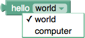

**[Creating Custom Blocks](CustomBlocks): [Defining Blocks](DefiningBlocks): Drop-down Menus**

Drop-down menus can be somewhat complicated field elements used in creating blocks.

## Language Neutrality

```
    input.appendField('hello');
    var dropdown = new Blockly.FieldDropdown([['world', 'WORLD'], ['computer', 'CPU']]);
    input.appendField(dropdown, 'MODE');
```


The ` FieldDropdown ` object is created with a list of menu options.  Each option is made up of two strings.  The first is the human-readable text to display.  The second is a string constant which is used when saving the option to XML.  This separation allows a dropdown menu's setting to be preserved between languages.  For instance an English (` en/ `) version of a block may define ` [['left', 'LEFT'], ['right', 'RIGHT']] ` while a German (` de/ `) version of the same block would define ` [['links', 'LEFT'], ['rechts', 'RIGHT']] `.

## Prefix/Suffix Matching

If all the menu options of a ` FieldDropdown ` object share common prefix and/or suffix words, these words are automatically factored out and inserted as static text.  For example, the same "hello world" code above could be rewritten like this:

```
    var dropdown = new Blockly.FieldDropdown([['hello world', 'WORLD'], ['hello computer', 'CPU']]);
    input.appendField(dropdown, 'MODE');
```

One advantage of this approach is that the block is easier for to translate into other languages.  The earlier code has the strings ` 'hello' `, ` 'world' `, and ` 'computer' `, whereas the revised code has the strings ` 'hello world' ` and ` 'hello computer' `.  Translators have a much easier time translating phrases than words in isolation.

Another advantage of this approach is that word order often changes between languages.  Imagine a language that used ` 'world hello' ` and ` 'computer hello' `.  The suffix matching algorithm will detect the common ` 'hello' ` and display it after the drop-down.

However, sometimes the prefix/suffix matching fails.  There are some cases where two words should always go together and the prefix should not be factored out.  For example ` 'drive red car' ` and ` 'drive red truck' ` should arguably only have ` 'drive' ` factored out, not ` 'drive red' `.  The Unicode non-breaking space ` '\u00A0' ` may be used in place of a regular space to suppress the prefix/suffix matcher.  Thus the above example can be fixed with ` 'drive red\u00A0car' ` and ` 'drive red\u00A0truck' `.

Another place where prefix/suffix matching fails is in languages that do not separate individual words with spaces.  Chinese is a good example.  The string
