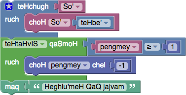

On 1 April 2014 we released a
[Klingon translation of Blockly](https://blockly-demo.appspot.com/static/apps/code/index.html?lang=tlh#ortpyd).
Klingon is an unusual choice for a translation, and on this page we wanted to
give some context on the hows and whys, as well as how you can help.

## Why?

Blockly has been translated into over 40 languages, including RTL languages such
as Arabic and Hebrew.  We feel that it is important that novice programmers are
able to learn the fundamentals of programming in their own language, before
making the transition to conventional English-based programming languages.

Klingon is a real language in every sense of the word.  It is not just a
collection of made-up words thrown together for a movie.  Instead, it has been
crafted by linguists over the course of decades.  The Klingon language has a
complicated grammar that is completely unique.

Consider word order.  English follows the Subject-Verb-Object order ("The cat
eats the food.").  Hungarian follows the Object-Subject-Verb order ("The food
the cat eats.").  Hebrew follows the Verb-Subject-Object order ("Eats the cat
the food.").  Klingon is the most bizarre, with Object-Verb-Subject order ("The
food eats the cat."). Supporting Klingon is the ultimate test of Blockly's
flexibility.  Block inputs need to be reordered, suffix groups need to be added,
rules for plurals need to be rethought.  Infrastructure improvements made during
the course of translating to Klingon help us support all languages.

## Who?

The number of Google employees who are fluent in Klingon is larger than one
might expect (and we are hiring).  Google's Klingon language group maintains
a style guide for terminology so that different applications use a consistent
vocabulary.

We are always pleased when volunteers come forward to contribute new
translations or corrections -- whether for Klingon, or other languages.

## How?

Most of [Blockly's translations](Translation) are done by volunteers using
Translatewiki.  Unfortunately, Klingon is not in their language matrix.
As a result, Klingon contributors need to edit two files manually:

https://github.com/google/blockly/tree/master/msg/json/tlh.json

and

https://github.com/google/blockly/tree/master/apps/json/tlh.json

See the ` en.json ` files in each directory for the English phrases (including
those not yet translated to Klingon), and the ` qqq.json ` files for descriptions.
We actively do not want tooltip messages or help URLs translated since they
offer useful context for those new to Klingon.

All phrases _must_ be manually translated.  Bing Translate produces such
translations as ` "Library" -> "be'nI''a'wI', Datu'" ` which actually means
` "discover my big sister" `.
Clearly this would be an inadvisable phrase to use in a Klingon environment.
