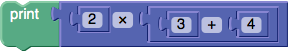

**[Creating Custom Blocks](CustomBlocks): [Generating Code](GeneratingCode): Operator Precedence**

Code generators are used to convert Blockly's programs into JavaScript, Python, Dart, etc.  The most challenging issue when writing a code generator for a new block is handling the order of operations so that the resulting code executes as intended.

# Bad Parentheses

Consider the following assembly of blocks.



If the generators were not aware of operator precedence, the resulting JavaScript code would be:
```
  alert(2 * 3 + 4);
```
This is obviously incorrect, since the multiplication operator rips apart the addition, grabbing the '3' for itself.  One solution is to wrap the result of every value block in parentheses:
```
  alert(((2) * ((3) + (4)));
```
This solution works perfectly, but it results in extremely messy code with large numbers of redundant parentheses.  For some use cases this is not an issue.  If human eyes are never going to see the generated code, then this is acceptable.  However, Blockly is often used as an educational tool to introduce programming, a use case which relies on generating human-readable code.

# Good Parentheses

To generate correct code without an unreasonable number of parentheses, each language generator is provided with an ordered list of precedences.  Here is the list for JavaScript:

```
Blockly.JavaScript.ORDER_ATOMIC = 0;         // 0 "" ...
Blockly.JavaScript.ORDER_MEMBER = 1;         // . []
Blockly.JavaScript.ORDER_NEW = 1;            // new
Blockly.JavaScript.ORDER_FUNCTION_CALL = 2;  // ()
Blockly.JavaScript.ORDER_INCREMENT = 3;      // ++
Blockly.JavaScript.ORDER_DECREMENT = 3;      // --
Blockly.JavaScript.ORDER_LOGICAL_NOT = 4;    // !
Blockly.JavaScript.ORDER_BITWISE_NOT = 4;    // ~
Blockly.JavaScript.ORDER_UNARY_PLUS = 4;     // +
Blockly.JavaScript.ORDER_UNARY_NEGATION = 4; // -
Blockly.JavaScript.ORDER_TYPEOF = 4;         // typeof
Blockly.JavaScript.ORDER_VOID = 4;           // void
Blockly.JavaScript.ORDER_DELETE = 4;         // delete
Blockly.JavaScript.ORDER_MULTIPLICATION = 5; // *
Blockly.JavaScript.ORDER_DIVISION = 5;       // /
Blockly.JavaScript.ORDER_MODULUS = 5;        // %
Blockly.JavaScript.ORDER_ADDITION = 6;       // +
Blockly.JavaScript.ORDER_SUBTRACTION = 6;    // -
Blockly.JavaScript.ORDER_BITWISE_SHIFT = 7;  // << >> >>>
Blockly.JavaScript.ORDER_RELATIONAL = 8;     // < <= > >=
Blockly.JavaScript.ORDER_IN = 8;             // in
Blockly.JavaScript.ORDER_INSTANCEOF = 8;     // instanceof
Blockly.JavaScript.ORDER_EQUALITY = 9;       // == != === !==
Blockly.JavaScript.ORDER_BITWISE_AND = 10;   // &
Blockly.JavaScript.ORDER_BITWISE_XOR = 11;   // ^
Blockly.JavaScript.ORDER_BITWISE_OR = 12;    // |
Blockly.JavaScript.ORDER_LOGICAL_AND = 13;   // &&
Blockly.JavaScript.ORDER_LOGICAL_OR = 14;    // ||
Blockly.JavaScript.ORDER_CONDITIONAL = 15;   // ?:
Blockly.JavaScript.ORDER_ASSIGNMENT = 16;    // = += -= *= /= %= <<= >>= ...
Blockly.JavaScript.ORDER_COMMA = 17;         // ,
Blockly.JavaScript.ORDER_NONE = 99;          // (...)
```

The bulk of this list is taken directly from JavaScript's [language spec](https://developer.mozilla.org/en/JavaScript/Reference/Operators/Operator_Precedence), with ` ORDER_ATOMIC ` added to the start and ` ORDER_NONE ` added to the end.

Applying these orders occurs in two places within each block's generator.  The first place is when fetching generated code from a connected value block.  In this case we pass the constant which represents the maximum binding strength of any operators adjacent to the sub-block's generated code.  For example:
```
  var arg0 = Blockly.JavaScript.valueToCode(this, 'NUM1', Blockly.JavaScript.ORDER_DIVISION);
```
The second place is when returning generated code from a value block.  In this case we pass the constant which represents the minimum binding strength of any operators in the block's generated code.  For example:
```
  return [arg0 + ' / ' + arg1, Blockly.JavaScript.ORDER_DIVISION];
```

If the order value returned by the sub-block is weaker than or equal to the order value for the order argument of the parent block, then the ` valueToCode ` function will automatically wrap the contents of the sub-block's code in parentheses to prevent it from being ripped apart by the parent block's code.

Below are some more examples.  In each case the block has one connected sub-block which is represented as 'X' (the contents of 'X' is unknown and doesn't matter).  The second column lists the strongest operator which might split 'X'.  The third column lists the weakest operator in the final code for the block.

| **Generated Code** | **Max strength against X** | **Min strength of block** |
|:-------------------|:---------------------------|:--------------------------|
| ` X + 1 `          | ` ORDER_ADDITION `         | ` ORDER_ADDITION `        |
| ` Math.sqrt(X) `   | ` ORDER_NONE `             | ` ORDER_MEMBER `          |
| ` !X && false `    | ` ORDER_LOGICAL_NOT `      | ` ORDER_LOGICAL_AND `     |
| ` foo[X % 60] `    | ` ORDER_MODULUS `          | ` ORDER_MEMBER `          |

# Math is hard

Still don't understand?  No problem.  Just use ` ORDER_ATOMIC ` as the order on every call to ` valueToCode `, and use ` ORDER_NONE ` as the order for the final return statement on every value block.  The resulting code will be infested with needless parentheses, but is guaranteed to be correct.