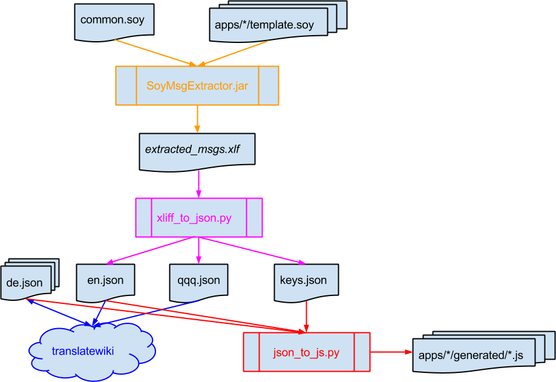
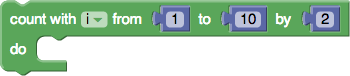

This document provides what developers should know about Blockly translations.  Translators should read [this document](Translation) instead.

# Introduction

Internationalization (i18n) is one of Blockly's top priorities.  See, for example, [CS in VN](https://neil.fraser.name/news/2013/03/16/).  Blockly supports right-to-left and left-to-right scripts, and the [Puzzle application](https://blockly-demo.appspot.com/static/apps/puzzle/index.html) has been translated into over 50 languages.  We look forward to getting all of Blockly translated into that many languages.

# TranslateWiki
We use [TranslateWiki](http://www.translatewiki.net) as our translation console and translator community.  We provide them with the following files:
  * **qqq.json**, mapping message names to _message documentation_ (information for translators).
  * **en.json**, mapping message names to the English-language text.  Note that we use Canadian English.
  * **_LANG_.json**, mapping message names to the appropriate language text.  Messages that have not been translated to the given language will not be present in this file.
_LANG_ is (loosely) an [IETF language tag](https://en.wikipedia.org/wiki/IETF_language_tag), such as "de" for German or "pt-br" for Brazilian Portuguese.  See this [incomplete list of languages supported by translatewiki](https://translatewiki.net/wiki/Special:SupportedLanguages).

TranslateWiki gives us _LANG_.json files and sometimes a modified ` qqq.json ` files with improved messages.  All files are transferred through our repository, to which TranslateWiki has access.  Our
contact is Siebrand Mazeland.

# Applications and Tutorials

The Blockly applications and tutorials (henceforth referred to as "apps") are built with "Soy", also known as [Google Closure templates](https://developers.google.com/closure/templates/), which has [translation tools](https://developers.google.com/closure/templates/docs/translation).  Specifically, all messages appear in files whose name ends with the "soy" extension.   Messages used by multiple apps are defined in [apps/common.soy](https://github.com/google/blockly/tree/master/apps/common.soy), and have the prefix "Apps."  Messages used by only a single app are defined in that app's template.soy file, such as [apps/maze/template.soy](https://github.com/google/blockly/tree/master/apps/maze/template.soy) and prefixed with the name of the application, such as "Maze.".

## The msg tag
Here is an example of a message definition:

```
{msg meaning="Maze.moveForward"
     desc="block text - Imperative or infinitive of a verb for a person moving
           (walking) in the direction he/she is facing."}
  move forward
{/msg}
```

Notes:
  * The key is defined through the "meaning" attribute: "Maze.moveForward".
  * The message documentation for the translator is defined through the "desc" attribute.  This appears as the value in the qqq.json file.
  * The English language text appears between the "msg" start and end tags.  This appears as the value in the en.json file.

A left brace or right brace can be included in an attribute value by using double braces to introduce and close the "msg" tags and writing "{lb}" [brace](left) for "{" or "{rb}" for "}", as in this definition:

```
{{msg meaning="Puzzle.country1Language"
      desc="The English language.{lb}{lb}Identical|English{rb}{rb}"}}
  English
{{/msg}}
```
(The TranslateWiki "Identical" tag is shrouded in mystery.  It was added to a Blockly file by a TranslateWiki wizard, and I was told not to worry about why.)

## Placement of the msg tag

### Messages used only once within a template

If a message is used only once and the use is within the template, it can be defined where it is used:

```
<button class="notext"
        title="{msg meaning="Apps.codeTooltip"
                    desc="tooltip (pop-up help) for button; pressing the button causes a program in the
                          JavaScript computer language to be displayed, based on the program created by the user."}
                 See generated JavaScript code.
            {/msg}"
        onclick="BlocklyApps.showCode(this);">
  
</button>
```


### Messages referenced from JavaScript files
If a message is used by a JavaScript file, such as maze.js or blocks.js, it must be declared within a span:

```
<span id="Maze_moveForward">
  {msg meaning="Maze.moveForward"
       desc="block text - Imperative or infinitive of a verb for a person moving
             (walking) in the direction he/she is facing."}
    move forward
  {/msg}
</span>
```
By convention, the id of the span is the same as the "meaning" key but replaces periods with underscores.  The message is referenced from code through the method ` BlocklyApps.getMsg() `, as in the example below from [apps/maze/blocks.js](https://github.com/google/blockly/tree/master/apps/maze/blocks.js):

```
Blockly.Blocks['maze_moveForward'] = {
  // Block for moving forward.  [A portion of the following code is omitted.]
  init: function() {
    this.setColour(290);
    this.appendDummyInput()
        .appendField(BlocklyApps.getMsg('Maze_moveForward'));
  }
};
```

### Messages used multiple times
If a message is used multiple times within one or multiple template files, all "msg" tags should have the same "meaning" attribute and enclosed text, but only one should have the real description as the "desc" attribute.  The others should have "IBID" (case-insensitive).

If a message is used in more than one app, it should be defined within a span in [apps/common.soy](https://github.com/google/blockly/tree/master/apps/common.soy), and its meaning should be prefixed with "Apps.".  For example, common.soy includes:

```
<span id="blocklyMessage">
  {msg meaning="Apps.blocklyMessage"
         desc="The project name.  If readers of your language would know approximately how to pronounce 'Blockly',
               leave unchanged.  Otherwise, include a transliteration in parentheses, such as the Russian:
               'Blockly (\u0411\u043bo\u043a\u043b\u0438)'."}
     Blockly
  {/msg}
</span>
```

Here is a sample use from [apps/turtle/template.soy](https://github.com/google/blockly/tree/master/apps/turtle/template.soy):
```
<a href="../index.html">{msg meaning="Apps.blocklyMessage" desc="IBID"}Blockly{/msg}</a>
```

## Build process

### Building a single app in English

Every app's template.soy file contains a comment near the top describing how to rebuild its English-language message file (apps/` * `/generated/en.js).  For example, this command appears at the top of [apps/turtle/template.soy](https://github.com/google/blockly/tree/master/apps/turtle/template.soy):

```
java -jar ../_soy/SoyToJsSrcCompiler.jar --outputPathFormat generated/en.js --srcs ../common.soy,template.soy
```

When run in the apps/turtle directory, this rebuilds [apps/turtle/generated/en.js](https://github.com/google/blockly/tree/master/apps/turtle/generated/en.js).

Emacs users might want to add the following to their .emacs file to automatically regenerate the appropriate en.js file whenever a template.soy file is saved:
```
(add-hook 'after-save-hook
  (lambda ()
    (if (string-match "^template.soy\\(<.*>\\)?$" (buffer-name))
        (shell-command "java -jar ../_soy/SoyToJsSrcCompiler.jar --outputPathFormat generated/en.js --srcs ../common.soy,template.soy"))))
```
Of course, if you have a different path to ` _soy ` or wish to generate "en\_us.js" instead of "en.js", you will need to change the command.


### Doing a full build

Before checking in code, developers should do a full i18n build by following the instructions in comments at the top of [apps/common.soy](https://github.com/google/blockly/tree/master/apps/common.soy).  The below diagram shows the build process.   It is followed by a description of each step.



#### SoyMsgExtractor.jar

<font color='orange'>SoyMsgExtractor.jar</font> extracts the messages from the template files into ` extracted_msgs.xlf `.  For example, this message:

```
{msg meaning="Maze.moveForward"
     desc="block text - Imperative or infinitive of a verb for a person moving
           (walking) in the direction he/she is facing."}
  move forward
{/msg}
```

becomes:

```
<trans-unit id="4138774728570944645" datatype="html">
  <source>move forward</source>
  <note priority="1" from="description">block text - Imperative or infinitive of a verb for a person moving
                           (walking) in the direction he/she is facing.</note>
  <note priority="1" from="meaning">Maze.moveForward</note>
</trans-unit>
```

The ` id ` is some sort of hash value that changes whenever the message description changes.

#### xliff\_to\_json.py

The script <font color='magenta'><a href='https://github.com/google/blockly/tree/master/i18n/xliff_to_json.py'>xliff_to_json.py</a></font> takes ` extracted_msgs.xlf ` as input and generates three JSON files that use message "meanings" (such as `Maze.moveForward') as keys:
  * [qqq.json](https://github.com/google/blockly/tree/master/apps/json/qqq.json), where the values are the message documentation (translator instructions).
  * [en.json](https://github.com/google/blockly/tree/master/apps/json/en.json), where the values are the English-language messages (e.g., "move forward").
  * [keys.json](https://github.com/google/blockly/tree/master/apps/json/keys.json), where the values are ` id `s from ` extracted_msgs.xlf `, such as "4138774728570944645".

Note that these do not change the other languages' json files, which were generated by <font color='blue'>translatewiki</font>.  These files are automatically picked up by Siebrand Mazeland at translatewiki, who periodically checks in updated qqq.json and other languages' JSON files as blockly@translatewiki.net.

#### json\_to\_js.py

Finally, the script <font color='red'>json_to_js.py</font> uses the JSON files and template files to generate JavaScript files for each app-language combination, such as [apps/maze/generated/es.js](https://github.com/google/blockly/tree/master/apps/maze/generated/es.js), the Spanish translation of the maze application.

## Translation status

The status of the translations can be found at "https://translatewiki.net/w/i.php?title=Special%3AMessageGroupStats&x=D&group=out-blockly-apps&suppressempty=1".

To see how complete each application is, run the following from the ` apps/ ` directory:
```
../i18n/status.py json/*.json --html > status.html
```
View the resulting file in a browser.  Additional options can be seen with:
```
../i18n/status.py --help
```

# The Blockly Language

"The Blockly language" or "core Blockly" refers to the blocks that are defined in [blocks/](http://code.google.com/p/blockly/source/browse/#svn%2Ftrunk%2Fblocks) and are independent of (although used by) the apps.  These include blocks for:
  * control flow (such as if and if-else)
  * loops
  * mathematical and logical functions and values
  * functions on text and on lists
  * creating and using functions and variables
In this context of "the core Blockly language", "core" does _not_ refer to the directory [core/](http://code.google.com/p/blockly/source/browse/#svn%2Ftrunk%2Fcore), which contains Blockly's low-level base, which is not directly visible to users.

Because the core Blockly language may be used by developers who do not use Closure or Soy, and because the messages are only referenced from JavaScript, we use a different pipeline than described above for messages for applications and tutorials.

## messages.js

### definitions and descriptions

Messages are defined in the file [msg/messages.js](https://github.com/google/blockly/tree/master/msg/messages.js) using the following format:
```
/// <DESCRIPTION>
Blockly.Msg.<KEY> = '<TEXT>';
```
Descriptions may be multiple lines, each of which is preceded by three slashes (` /// `).  The key and English-language text must be on a single line, and the text must be delimited by single quotation marks immediately followed by a semicolon.

Here is a sample definition:
```
/// dropdown - This finds the most common numbers ([https://en.wikipedia.org/wiki/Mode_(statistics) modes])
/// in a list.  For example, the modes of the list {1, 3, 9, 3, 9}  are {3, 9}.
Blockly.Msg.MATH_ONLIST_OPERATOR_MODE = 'modes of list';
```

By convention, descriptions start with one of the terms listed in https://translatewiki.net/wiki/Translating:Blockly#Messages_associated_with_blocks.  It is followed by a hyphen and a message description starting with a capital letter and ending with a period.

The use of [MediaWiki markup](http://www.mediawiki.org/wiki/Help:Formatting) is encouraged, including external links to this Blockly wiki, Wikipedia, and saved programs illustrating the use of a block.  Files may be [uploaded to translatewiki](https://translatewiki.net/wiki/Special:Upload) and referenced as shown in the following example:
```
/// block text - Title of blocks allowing users to find text.  See
/// [https://github.com/google/blockly/wiki/Text#Finding_text
/// https://github.com/google/blockly/wiki/Text#Finding_text].
/// [[File:Blockly-find-text.png]]
Blockly.Msg.TEXT_INDEXOF_INPUT_INTEXT = 'in text';
```
This causes the picture to be displayed in-line for the translator.

Developers are encouraged to read through [msg/messages.js](https://github.com/google/blockly/tree/master/msg/messages.js) and to use the [Translation](Translation) interface before creating their own messages.

### synonyms

In some cases, one message is defined to be equal to another, as in:

```
Blockly.Msg.TEXT_APPEND_VARIABLE = Blockly.Msg.VARIABLES_DEFAULT_NAME;
```

This says that the default name of the variable in the "text append" block is the same as the general default variable.  The format must be exactly as shown.  It is not possible to include any other code on the line, such as concatenating two messages.

These synonyms exist either for historical reasons (they used to have different values) or to facilitate making them different in the future.

Synonym definitions may appear anywhere in ` messages.js ` after the right-hand value has been defined.

## Message interpolation

Ideally, translators should be given sentences, rather than bits of pieces of text to be concatenated with data.  This can sometimes be provided through message interpolation, as in this example:


```
/// block title - Title of [https://github.com/google/blockly/wiki/Loops#count_with count with] blocks.
Blockly.Msg.CONTROLS_FOR_INPUT_WITH = 'count with';

/// block text - Starting with a (usually lower) number in a range (%1),
/// ending with a (usually higher) number in a range (%2), and counting the
/// iterations by a number of steps (%3).  As in
/// [https://github.com/google/blockly/wiki/Loops#count_with
/// https://github.com/google/blockly/wiki/Loops#count_with].
Blockly.Msg.CONTROLS_FOR_INPUT_FROM_TO_BY = 'from %1 to %2 by %3';
```
The relevant part of the definition of the 'controls\_for' block in blocks/loops.js is:
```
    this.appendDummyInput()
        .appendField(Blockly.Msg.CONTROLS_FOR_INPUT_WITH)
        .appendField(new Blockly.FieldVariable(null), 'VAR');
    this.interpolateMsg(Blockly.Msg.CONTROLS_FOR_INPUT_FROM_TO_BY,
                        ['FROM', 'Number', Blockly.ALIGN_RIGHT],
                        ['TO', 'Number', Blockly.ALIGN_RIGHT],
                        ['BY', 'Number', Blockly.ALIGN_RIGHT],
                        Blockly.ALIGN_RIGHT);
```
The %1, %2, and %3 are placeholders respectively for the 'FROM', 'TO', and 'BY' numbers.

Note that the two messages could not have been combined into a single one because interpolation only supports sockets, not dropdowns, text fields, number fields, etc.

## Build process

Building consists of two steps: (1) generating JSON files and (2) generating JS files.  They are built automatically by the main [build.py script](https://github.com/google/blockly/tree/master/build.py) but can also be built by executing the following two scripts.

### Generating JSON files

Translatewiki requires [en.json](https://github.com/google/blockly/tree/master/msg/json/en.json) and [qqq.json](https://github.com/google/blockly/tree/master/msg/json/qqq.json).  We also require a file [synonyms.json](https://github.com/google/blockly/tree/master/msg/json/synonyms.json), to keep track of synonymous messages.  These three files are generated by running the following command from the ` msg/ ` directory:
```
../i18n/js_to_json.py
```
The script [js\_to\_json.py](https://github.com/google/blockly/tree/master/i18n/js_to_json.py) contains the regular expressions matching lines in ` messages.js `, in case any question arises about syntax.

### Generating JavaScript files

The JSON files produced in the previous step, as well as any obtained from translatewiki are used by the following script:
```
../i18n/create_messages.py json/*.json
```
This populates the directory [msg/js/](https://github.com/google/blockly/tree/master/msg/js).
Any messages not defined in a language's .json file will have the original English-language text, as shown by this excerpt from zh-tw.js:
```
Blockly.Msg.CHANGE_VALUE_TITLE = "修改值:";
Blockly.Msg.COLLAPSE_ALL = "Collapse Blocks";  // untranslated
```
The comment "untranslated" is added automatically by [create\_messages.py](https://github.com/google/blockly/tree/master/i18n/create_messages.py).

## Translation status

The status of the translations can be found at "https://translatewiki.net/w/i.php?title=Special%3AMessageGroupStats&x=D&group=out-blockly-core&suppressempty=1".
