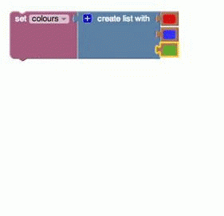

# Introduction

As in everyday speech, a Blockly list is an ordered collection of items, such as a "to do" list or a shopping list.  Items in a list may be of any type, and the same value may appear more than once in a list.

# List Creation

## create empty list

The simplest list is the empty list, which is created with the **create empty list** block:

## create list with

### basic usage
The **create list with** block allows the user to specify the initial values in a new list.  In this example, a list of words is being created and placed in a variable named **letters**:

For this document, we'll denote this list as ["alpha", "beta", "gamma"], and we will refer below to the variables defined in this section.

This shows the creation of a list of numbers:

This creates a list of colours:

It is less common, but possible, to create a list with values of different types:

### changing number of inputs

To change the number of inputs, click on the plus ("+") icon.  This opens a new window:

You can then drag **item** sublocks from the left side of the window into the **if** block on the right side to add a new input, as shown:

While the new item was added at the bottom in this example, it can be added anywhere.  Similarly, unwanted **item** subblocks can be dragged off the **if** block to the left.

## create list with item

The **create list with item** block lets you create a list that has the specified number of copies of an item.  For example, the following blocks set the variable **words** to the list containing ["very", "very", "very"].

# Checking a List's Length

## is empty

The value of an **is empty** block is **true** if its input is the empty list and **false** if it is anything else (including a non-list).  IS THIS TRUE?  The value of the following blocks would be **false** because the variable **colours** is not empty: it has three items.

Note the similarity to the ["is empty" block for text](Text#Checking_for_empty_text).

## length of

The value of the **length of** block is the number of elements in the list used as an input.  For example, the value of the following blocks would be 3 because colour has three items.

Note that the **length of** block tells you how many items are in the list, not how many _different_ items are in it.  For example, the following has the value 3, even though **words** consists of three copies of the same text (["very", "very", "very"]).

Note the similarity to the ["length of" block for text](Text#Text_length).

# Finding Items in a List

These blocks find the position of an item in a list.  For example, the following has a value of 1 because the first appearance of "very" is as the beginning of the **words** list (["very", "very", "very"]).

The result of the following is 3 because the last appearance of "very" in **words** is in position 3.

If the item is nowhere in the list, the result is in the value 0, as in this example:

These blocks are analogous to [the ones for finding letters in text](Text#Finding_text).

# Getting Items from a List

## Getting a single item

Recall the definition of the list **colours**:

The following block gets the color blue because it is the second element in the list (counting from the beginning on the left):

This gets green because it is the second element counting from the right end:

This gets the first element, red:

This gets the last element, yellow:

This randomly selects an item from the list, returning any of red, blue, green, or yellow with equal likelihood.

### Getting and removing an item

A dropdown menu on the **in list ... get** block changes it to **in list ... get and remove**, which provides the same otuput but also modifies the original list:

This example sets the variable **first letter** to "alpha" and leaves **letters** as: ["beta", "gamma"].

### Removing an item

Selecting "remove" on the dropdown causes the plug on the left of the block to disappear:

This removes the first item from **letters**.

## Getting a sublist

The **in list ... get sublist** block is similar to the **in list ... get** block except that it extracts a sublist, rather than an individual item.  There are several options for how the start and end of the sublist can be specified:

A few languages (notably Hungarian) require text following the right socket (hole).  This is referred to as a "tail" message.

In this example, a new list **first letters** is created.  This new list has two elements: ["alpha", "beta"].

Note that this block does not modify the original list.

# Adding Items to a List

## in list ... set

The **in list ... set** block replaces the item at a specified location in a list with a different item.

For the meaning of each of the dropdown options, see the [previous section](Lists#Getting_Items_from_a_List).

The following example does two things:
  1. The list **words** is created with 3 items: ["very", "very", "very"].
  1. The third item in the list is replaced by "good".  The new value of **words** is ["very", "very", "good"].

## in list ... insert at

The **in list ... insert at** block is obtained by using the dropdown menu on the **in list ... set** block:

It inserts a new item into the list at the specified location, before the item previously at that location.  The following example (built on an earlier one) does three things:

  1. The list **words** is created with 3 items: ["very", "very", "very"].
  1. The third item in the list is replaced by "good".  The new value of **words** is ["very", "very", "good"].
  1. The word "you're" is inserted at the beginning of the list.  The final value of **words** is ["You're", "very", "very", "good"].

# Related Blocks

## Printing a list

The [print block](Text#Printing_text) in the Text category can print lists.  The result of the following program is the shown alert box:

## Doing something for each item in a list

The [for-each block](Loops#for_each) in the Control category performs an operation on every item in a list.  For example, these blocks individually print each item in the list:

This does not remove the items from the original list.

See also the examples of the [loop termination blocks](Loops#Loop_Termination_Blocks).
